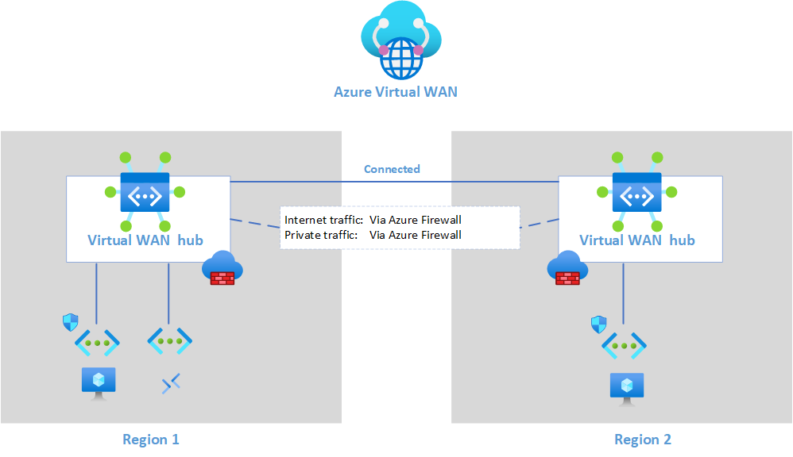

# Azure Virtual WAN with Routing Intent using Terraform

## Introduction

This a repository containing Terraform code to demonstrate the use of Routing Intent with Azure Virtual WAN.

The Terraform code recreates the following architecture:



List of resources deployed

- Virtual WAN
- Virtual WAN Hub x2
- Hub Firewall x2
- Log Analytics Workspace
- Firewall Policy
- VNet x3
- Bastion
- Virtual Machine x2

## Requirements

- A [Microsoft Azure](https://azure.microsoft.com) Subscription with Contributor or greater access
- The following must be installed
    - [Terraform](https://terraform.io) CLI
    - [Azure CLI](https://learn.microsoft.com/en-us/cli/azure/)
- Terraform version `v1.6.3`
- AzureRM provider version `v3.7.8`

## Usage

1. Configure environment for access to azure
    - Authenticate using Azure CLI

    ```bash
        az login
    ```

    - Select subscription for deployment

    ```bash
        az account set --subscription "<SUBSCRIPTION_ID>"
    ```

1. Initialse Terraform configuration

    ```bash
    terraform init
    ```

1. Validate the Terraform changes

    ```bash
    terraform plan -out tfplan
    ```

    It is recommended to save the Terraform plan to a file, by using the `-out` option to ensure you are applying the changes that were advertised by the plan command.
1. Apply the terraform changes

    ```bash
    terraform apply tfplan
    ```

1. Validate the infrastructure
    - Connect to the Virtual Machines using the [connect by IP](https://learn.microsoft.com/en-us/azure/bastion/connect-ip-address) function of Azure Bastion
    - For testing purposes, you need to allow ICMP ping through the firewall of each VM
    - Check the connection between the two VMs using their private IP addresses
    - Check the Log Analytics workspace for evidence of the Firewall being used for traffic
1. Clean up resources once finished (be wary of Firewall + VWAN costs when testing!)
    - Create a Terraform plan for removal of resources

    ```bash
        terraform plan -destroy -out tfplan_destroy
    ```

    - Apply removal plan to clean up resources

    ```bash
        terraform apply tfplan_destroy
    ```
